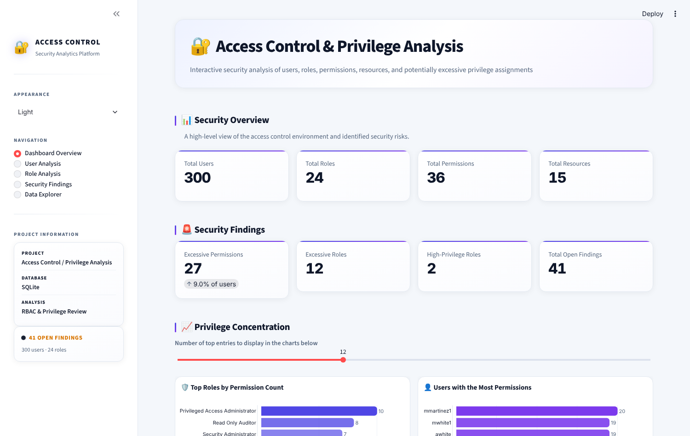
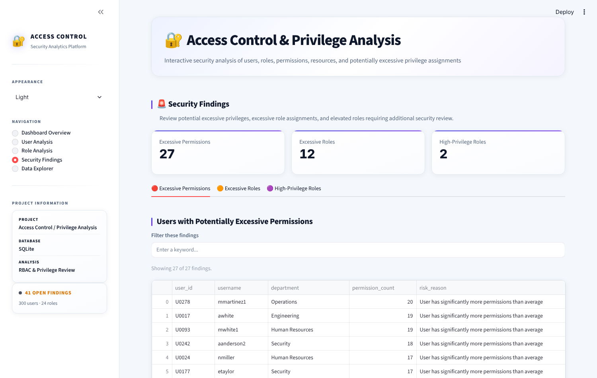
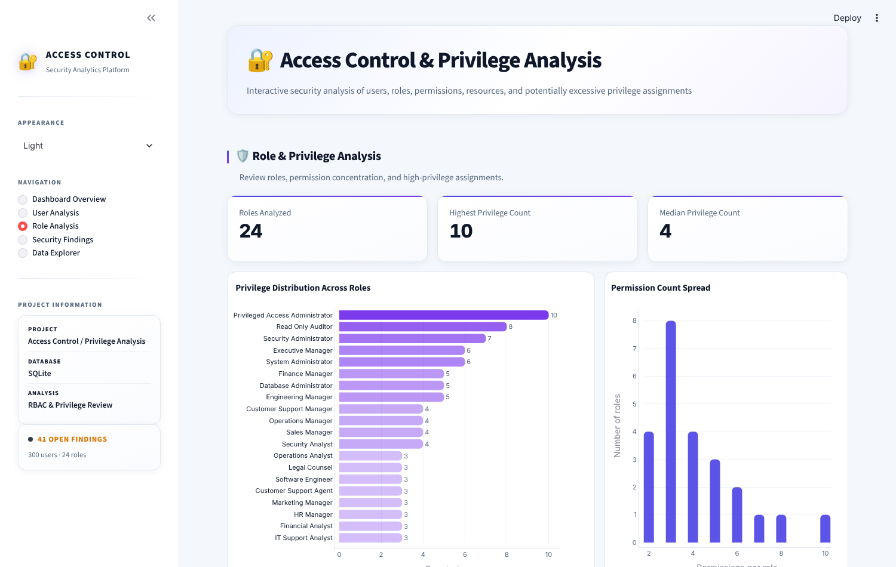

# Access Control & Privilege Analysis

A security analytics project that reviews who has access to what in a role-based access control (RBAC) environment, and flags users and roles that hold more privilege than they should.

Built with Python, SQL (SQLite), scikit-learn and Streamlit.



## What it does

- Models an organisation's access structure: users → roles → permissions → resources
- Finds users with excessive permissions or too many roles (privilege creep)
- Identifies high-privilege roles that need closer monitoring
- Uses machine learning to surface unusual access patterns that fixed thresholds miss
- Presents everything in an interactive dashboard with filters and a data explorer

## Results on the sample environment

| Measure | Value |
|---|---|
| Users | 300 |
| Roles | 24 |
| Permissions | 36 |
| Resources | 15 |
| Users with excessive permissions | 27 (9.0%) |
| Users with excessive roles | 12 |
| High-privilege roles | 2 |
| Total open findings | 41 |

The dataset is synthetic. It is generated by `src/data_generator.py` to resemble a realistic enterprise, and contains no real people or systems.

## How it works

```text
CSV access data  →  SQLite database  →  Rule-based analysis  →  ML analysis  →  Streamlit dashboard
```

| Stage | Method |
|---|---|
| Storage and querying | SQLite, with SQL joins and aggregations across users, roles and permissions |
| Rule-based findings | Compares each user's role and permission counts against the rest of the organisation |
| Anomaly detection | Isolation Forest flags users whose privilege profile is unusual |
| Pattern clustering | K-Means groups users with similar privilege profiles |
| Reporting | Streamlit dashboard with light and dark themes |

## Dashboard

| Security findings | Role analysis |
|---|---|
|  |  |

The dashboard has five pages: Dashboard Overview, User Analysis, Role Analysis, Security Findings and Data Explorer.

## Run it locally

```bash
git clone https://github.com/OmerNaeemKhan/Access-Control-Privilege-Analysis.git
cd Access-Control-Privilege-Analysis

python -m venv .venv
.venv\Scripts\activate          # Windows
# source .venv/bin/activate     # macOS / Linux

pip install -r requirements.txt
streamlit run dashboard/app.py
```

The repository includes the generated data, database and findings, so the dashboard runs straight away.

To rebuild the analysis from scratch, run the scripts listed below.

## Project structure

```text
├── dashboard/
│   ├── app.py                     Streamlit dashboard
│   ├── ai_privilege_analysis.py   Isolation Forest and K-Means analysis
│   └── outputs/                   Findings used by the dashboard
├── data/raw/                      Users, roles, permissions, resources and their mappings
├── database/
│   ├── access_control.db          SQLite database
│   └── sql_database.py            Builds the database and runs the SQL analysis
├── outputs/                       Rule-based findings as CSV
├── src/
│   ├── data_generator.py          Generates the synthetic dataset
│   ├── database_setup.py          Loads the CSV files into SQLite
│   └── access_analysis.py         Rule-based privilege analysis
├── screenshots/
└── requirements.txt
```

A full write-up is in `Access_Control_Privilege_Analysis_Project_Document.docx`.

## Skills demonstrated

Python · pandas · SQL · SQLite · scikit-learn · anomaly detection · clustering · Streamlit · RBAC · least-privilege analysis

## Author

**Omer Naeem Khan** — Data Analyst
[GitHub](https://github.com/OmerNaeemKhan) · [LinkedIn](https://www.linkedin.com/in/omer-khan-03833749)
